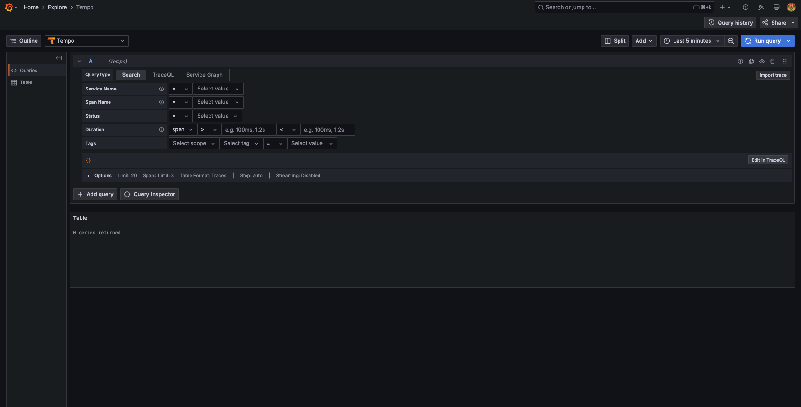

# README

- CONTENTS.
  - [Comparison of UI and functions between Grafana and new Relic](#comparison-of-ui-and-functions-between-grafana-and-new-relic)
    - [What is APM anyway?](#what-is-apm-anyway)
    - [Comparison items](#comparison-items)
      - [assumption](#assumption)
      - [basic ui](#basic-ui)
  - [sandbox system install](#sandbox-system-install)

## Comparison of UI and functions between Grafana and new Relic

### What is APM anyway?

APM is a monitoring technique for measuring application performance. For example, it can be used to check the performance from the length of methods in the code, the response time of the data store, or to improve the observability of distributed tracing.

[link](https://newrelic.com/jp/blog/best-practices/what-is-apm-service)

In this repository, I will compare APM with the OSS Grafana Tempo and the monitoring SaaS tool New Relic based on my knowledge.

### Comparison items

#### assumption

> [!NOTE]
> 
> * ***(Assumption 1):*** I will compare features based on OpenTelemetry instead of the tracer tool provided by each SaaS tool in this repository.
> 
> * ***(Assumption 2):*** To check the functionality in New Relic, check the `otel-collector/config.yaml`, modify it as necessary, and then check the operation.
> 
> * ***(Assumption 3):*** This Sandbox provides a sample application. Please check `sandbox-app/resource.yaml` for details.

#### Basic UI

||Grafana| New Relic|
|------ |------ | --------|
|APM Main Page UI ||  |
|APM Trace Page UI ||  |

※ If you look closely, you will see that the trace id is the same. Thus, we see that they are outputting the results of the same request.

Give your personal opinion (feelings, differences) on each UI base.

***Grafana***

The UI of Grafana + Grafana Tempo is very simple and straightforward. In particular, the Main page has a search bar that basically allows you to search for a trace, identify a trace, or even specify the Service you want to retrieve.


It also excels in basic real-time performance, reloading pages at minimum 5s intervals to obtain the latest trace.


***New Relic***

TBU

## sandbox system install

### Cluster Install

```bash:bash
❯ kind create cluster -n apm-test --config cluster/cluster.yaml
Creating cluster "apm-test" ...
 ✓ Ensuring node image (kindest/node:v1.27.3) 🖼
 ✓ Preparing nodes 📦 📦 📦 📦
 ✓ Writing configuration 📜
 ✓ Starting control-plane 🕹️
 ✓ Installing CNI 🔌
 ✓ Installing StorageClass 💾
 ✓ Joining worker nodes 🚜
Set kubectl context to "kind-apm-test"
You can now use your cluster with:

kubectl cluster-info --context kind-apm-test

Not sure what to do next? 😅  Check out https://kind.sigs.k8s.io/docs/user/quick-start/

```

### namespace install for cluster

```bash:bash
❯ kubectl apply -f cluster/namespace.yaml
```

### Role install

```bash:bash
❯ kubectl apply -f cluster/role.yaml
```

### Cert-manager Install

```bash:bash
❯ kubectl apply -f https://github.com/cert-manager/cert-manager/releases/download/v1.15.3/cert-manager.yaml
```

### GrafanaTempo Operator Install

```bash:bash
❯ kubectl apply -f https://github.com/grafana/tempo-operator/releases/latest/download/tempo-operator.yaml
```

### Minio install

```bash:bash
❯ kubectl apply -f https://raw.githubusercontent.com/grafana/tempo-operator/main/minio.yaml
```

### TempoCR

```bash:bash
❯ kubectl apply -k tempo/
```

### OpenTelemetry Operator Install

```bash:bash
❯ kubectl apply -f https://github.com/open-telemetry/opentelemetry-operator/releases/latest/download/opentelemetry-operator.yaml
```

### Install OpenTelemetry Collector Configuration

```bash:bash
❯ kubectl apply -f otel-controller/config.yaml
```

### grafana

```bash:bash
❯ kubectl apply -k grafana/
```
