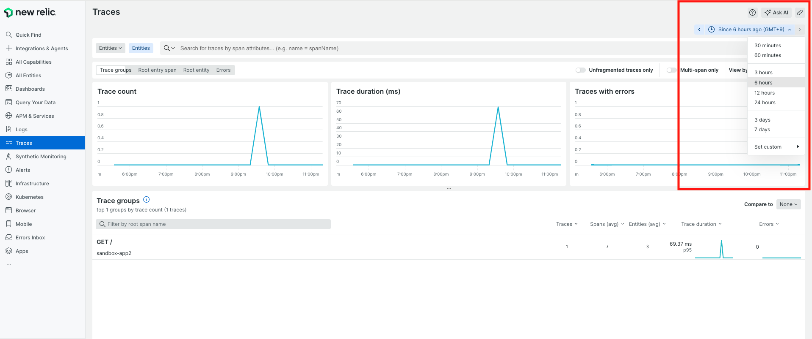
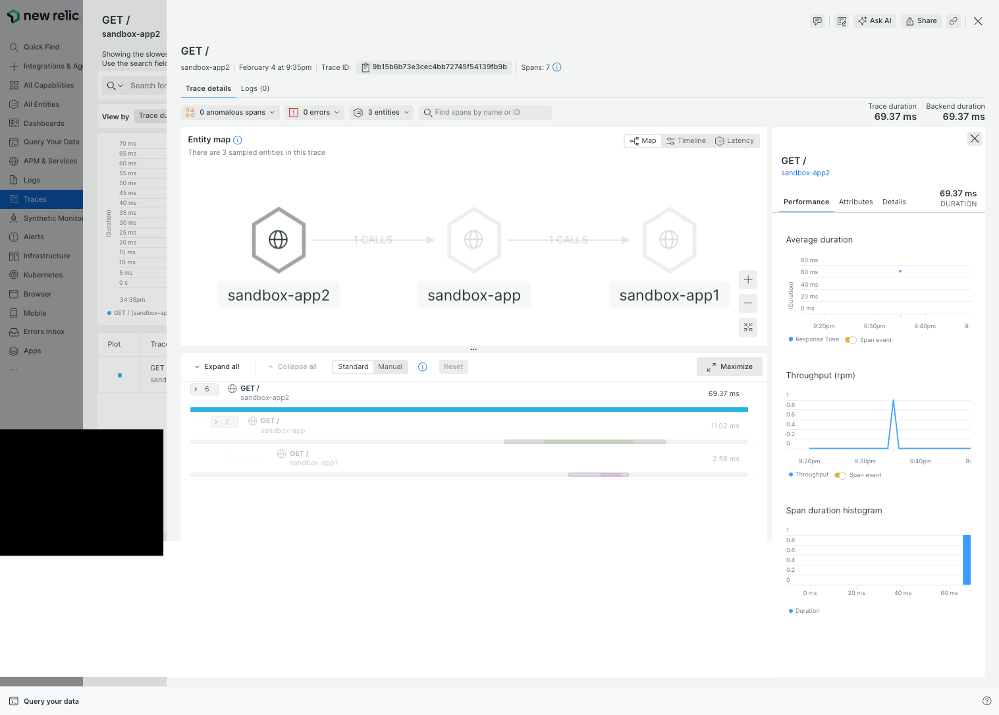

# README

- CONTENTS.
  - [What is APM anyway?](#what-is-apm-anyway)
  - [Comparison of UI and functions between Grafana and new Relic](#comparison-of-ui-and-functions-between-grafana-and-new-relic)
    - [About the applications we offer for using this sandbox](#about-the-applications-we-offer-for-using-this-sandbox)
    - [Comparison items](#comparison-items)
      - [assumption](#assumption)
      - [basic ui](#basic-ui)
      - [How easy is it to see the UI when an error occurs?](#how-easy-is-it-to-see-the-ui-when-an-error-occurs)
  - [sandbox system install](#sandbox-system-install)

## What is APM anyway?

APM is a monitoring technique for measuring application performance. For example, it can be used to check the performance from the length of methods in the code, the response time of the data store, or to improve the observability of distributed tracing.

[link](https://newrelic.com/jp/blog/best-practices/what-is-apm-service)

In this repository, I will compare APM with the OSS Grafana Tempo and the monitoring SaaS tool New Relic based on my knowledge.

## About the applications we offer for using this sandbox

This repository provides several sandbox applications (Python and Java applications) to check the behavior of APM.

Please check the following repositories for each application.

* python
  * [sandbox-otel-py-app](https://github.com/S-mishina/sandbox-otel-py-app)
* Java
  * [spring-boot-jmx-metrics-sample](https://github.com/S-mishina/spring-boot-jmx-metrics-sample)
    * ※ This application was originally created to check the behavior of jmx, but can be used as a sandbox because it includes code to put a span in the otel.


## Comparison of UI and functions between Grafana and new Relic

### Comparison items

#### assumption

> [!NOTE]
> 
> * ***(Assumption 1):*** I will compare features based on OpenTelemetry instead of the tracer tool provided by each SaaS tool in this repository.
> 
> * ***(Assumption 2):*** To check the functionality in New Relic, check the `otel-collector/config.yaml`, modify it as necessary, and then check the operation.
> 
> * ***(Assumption 3):*** This Sandbox provides a sample application. Please check `sandbox-app/resource.yaml` for details.

#### Basic UI

||Grafana| New Relic|
|------ |------ | --------|
|APM Trace Main Page UI ||  |
|APM Trace Page UI ||  |

※ If you look closely, you will see that the trace id is the same. Thus, we see that they are outputting the results of the same request.

Give your personal opinion (feelings, differences) on each UI base.

***Grafana***

The UI of Grafana + Grafana Tempo is very simple and straightforward. In particular, the Main page has a search bar that basically allows you to search for a trace, identify a trace, or even specify the Service you want to retrieve.


It also excels in basic real-time performance, reloading pages at minimum 5s intervals to obtain the latest trace.


If you check the trace page, you can basically see the results of the distributed tracing on a single page, where you can see the results (status) of the actions taken by the user.


As you can see, Grafana + Grafana Tempo, which is OSS, can be fully utilized as APM.

***New Relic***

The basic screen of New Relic is not much different from Grafana's, as you can see from the image comparison of the Basic UI.


The APM Trace Page, where the metrics appear together, is a revolutionary feature that Grafana does not have.


Looking at the New Relic screen, unlike Grafana + Grafana Tempo, it is not possible to get APM traces in real time.



However, New Relic's APM has another face. Although not discussed extensively in this session, there is a separate and powerful Service page in APM that allows you to check the status of your services on a metrics basis.


If you go back and check the specific information on TRACE, you will see that it is basically the same information as Grafana + Grafana Tempo.

I think the difference is that Grafana allows access to span information on a single page, whereas New Relic requires hovering over a specific span to investigate.


However, New Relic, again, has the advantage of being able to compare historical trends on a metrics basis when accessing Span.




***personal opinion***

This is completely my personal opinion, but I feel that when comparing monitoring SaaS vs. OSS monitoring tools on a UI basis in this way, it is more important which monitoring tool has more unique features as a monitoring tool than OSS vs. SaaS, and which is more suitable for the team implementing the tool.

For example, we felt that Grafana is more of a real-time and simple UI. Therefore, we think it could be said to be a monitoring tool that makes it easy to check failures and performance in real time.

Conversely, New Relic, when viewed as a trace, seems to focus mainly on the amount of information (ease of insight) rather than real-time performance.

What we can say from this is that the selection will depend on whether you want to design a monitoring tool that places APM at the main axis of the monitoring tool, or whether you want to use logs and metrics as the main axis of monitoring and use APM as supplementary information.

Since we have compared basic functionality on a UI basis up to this point, we would like to compare each monitoring tool using more specific use cases as examples.

#### How easy is it to see the UI when an error occurs?

TBU

## sandbox system install

### Cluster Install

```bash:bash
❯ kind create cluster -n apm-test --config cluster/cluster.yaml
Creating cluster "apm-test" ...
 ✓ Ensuring node image (kindest/node:v1.27.3) 🖼
 ✓ Preparing nodes 📦 📦 📦 📦
 ✓ Writing configuration 📜
 ✓ Starting control-plane 🕹️
 ✓ Installing CNI 🔌
 ✓ Installing StorageClass 💾
 ✓ Joining worker nodes 🚜
Set kubectl context to "kind-apm-test"
You can now use your cluster with:

kubectl cluster-info --context kind-apm-test

Not sure what to do next? 😅  Check out https://kind.sigs.k8s.io/docs/user/quick-start/

```

### namespace install for cluster

```bash:bash
❯ kubectl apply -f cluster/namespace.yaml
```

### Role install

```bash:bash
❯ kubectl apply -f cluster/role.yaml
```

### Cert-manager Install

```bash:bash
❯ kubectl apply -f https://github.com/cert-manager/cert-manager/releases/download/v1.15.3/cert-manager.yaml
```

### GrafanaTempo Operator Install

```bash:bash
❯ kubectl apply -f https://github.com/grafana/tempo-operator/releases/latest/download/tempo-operator.yaml
```

### Minio install

```bash:bash
❯ kubectl apply -f https://raw.githubusercontent.com/grafana/tempo-operator/main/minio.yaml
```

### TempoCR

```bash:bash
❯ kubectl apply -k tempo/
```

### OpenTelemetry Operator Install

```bash:bash
❯ kubectl apply -f https://github.com/open-telemetry/opentelemetry-operator/releases/latest/download/opentelemetry-operator.yaml
```

### Install OpenTelemetry Collector Configuration

```bash:bash
❯ kubectl apply -f otel-controller/config.yaml
```

### grafana

```bash:bash
❯ kubectl apply -k grafana/
```
